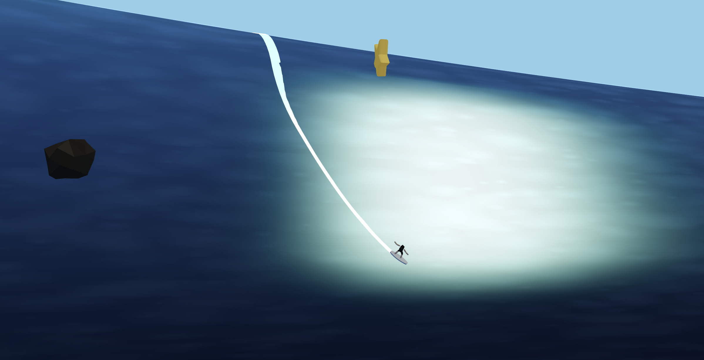

# Big Wave Surfing

**[Play it now](https://bigwavesurfing.fun)**



Big-wave surfing game in Three.js — ride big waves of different levels of difficulty, avoid obstacles, collect stars.

## Gameplay

You spawn on the open ocean as a massive wave approaches from behind. Turn your board, paddle into the wave, and ride the face ahead of the breaking foam. The wave breaks from left to right — stay in front of the break or get wiped out.

### Controls

| Key | Action |
|-----|--------|
| `↑` / `W` | Paddle forward |
| `↓` / `S` | Brake (drag arms in water) |
| `←` / `A` | Turn left |
| `→` / `D` | Turn right |

## Physics

- **Wave gravity** — the slope of the wave face accelerates the board in the direction it's pointing. Aim downhill to build speed, angle across the face to carve.
- **Fin constraint** — fins resist sideways slip, keeping the board tracking along its heading. Gentle carves preserve speed; hard snap turns bleed momentum.
- **Wake trail** — a white ribbon trails behind the board, wider and brighter at higher speed, fading over 5 seconds.

## Tech

- [Three.js](https://threejs.org/) — 3D rendering with a dynamic vertex-colored wave mesh
- [React](https://react.dev/) — HUD overlay (ride time, speed in m/s)
- [TypeScript](https://www.typescriptlang.org/) + [Vite](https://vitejs.dev/)

## Development

```bash
yarn install
yarn dev
```
